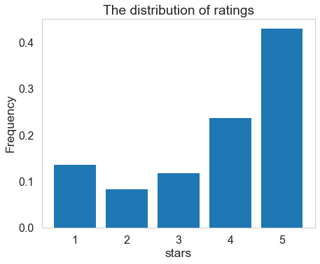
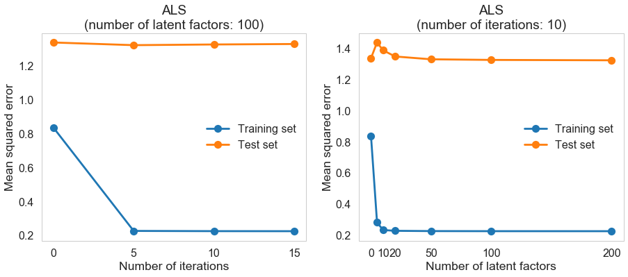
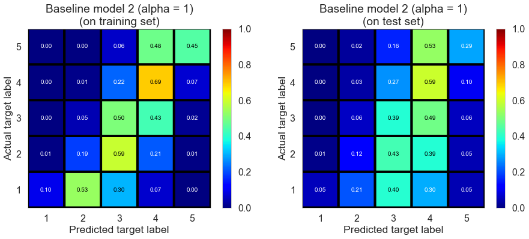
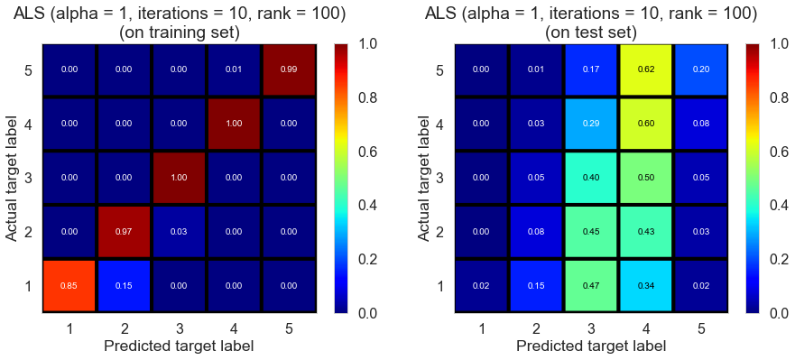

## EDA and Revised Project Statement
### Description of the data

In this project, we use "review" (shape: 4736897 X 9), "business" (shape: 156639 X 101)  and "user" (shape: 1183362 X 22) from [Yelp academic dataset](https://www.yelp.com/dataset/challenge). Each row in "review" specifies a review that a user makes on a restaurant (or a barbershop), including date, comment ("text") and rating ("stars"), as well as the number of votes received on this review ("funny", "useful" or "cool"). "Business" contains information on restaurants and barbershops appearing in "review", including typical attributes defining a restaurant (or a barbershop), open hours, geographic information and average ratings. There are a lot of missing values in "business", mostly caused by the missing of attribute descriptions. "User" contains information on users, including profile summaries, social networks on yelp and average ratings. "Review", "business" and "user" are linked together through "user\_id" and "business\_id".

To wrangle data for EDA and predictive modeling, we first checked and cleaned duplicate reviews (an user reviews a business for multiple times). We identified 1 case of duplicates involving 2 reviews; we simply dropped one of them since the ratings happen to be the same. Then we dropped barbershops and closed restaurants (~16.4% of rows in "business"), and kept reviews and users associated with remaining restaurants. Finally, we converted "user\_id" and "business\_id" to integers to save space and speed up computation. We checked the number of restaurants in each city (there are 980 cities in the remaining dataset), and sampled a small set by extracting data associated with restaurants in a medium-size city (we chose Champaign, which contains 878 opened restaurants, here) for benchmarking and the debugging of EDA and predictive modeling codes.

To build a recommender system, we can do collaborative filtering or content filtering. To perform collaborative filtering, we only need restaurant ratings from each user, which we can obtain by keeping 3 columns, i.e., "user\_id", "business\_id" and "stars", in "review". Content filtering requires a profile for each user or restaurant, which can characterize its nature; we can obtain the required data by merging "review" with "user" and "business" through "user\_id" and "business\_id" respectively.

### Noteworthy findings of the EDA

We first invetigated the distribution of user ratings.

It turns out most users rate 5 stars. We thus decided to build a mode estimator, which predicts each rating to be the mode value (i.e., 5). We tested the performance of 2 baseline models (based on mean estimation and Ridge regression with regularization parameter determined by cross-validation, respectively) and a latent factor model (sigular-value decomposition through alternating least squares, abbr., SVD-ALS). To gain some intuition about the impact of the number of iterations and the number of latent factors on training and test performance, we evaluated RMSE for different parameters on Champaign dataset (we did a half-half training/test split).

We fixed the number of iterations to 10 and the number of latent factors to 100, and evaluted each model on the Champaign dataset and full dataset. All experiments are run on a desktop with Inter Xeon CPU 3.10 GHz, 256 GB RAM. We did a half-half training/test split for each dataset. The results are as follows.

Champaign (20571 reviews) | Fitting time | Training RMSE | Test RMSE |
--- | --- | --- | --- 
ModeEstimator | | 2.0012 | 2.0176
BaselineMEAN | 0.017 s | 0.9438 | 1.4829
BseelineRegression | 0.033 s | 0.8353 | 1.3386
SVD-ALS | 23.38 s | 0.2245 | 1.3269

Full data (4166778 reviews) | Fitting time | Training RMSE | Test RMSE |
--- | --- | --- | --- 
ModeEstimator | | 1.8970 | 1.8985
BaselineMEAN | 3.51 s | 1.0068 | 1.4186
BseelineRegression | 27.19 s | 0.9198 | 1.2824
SVD-ALS | 67.46 min | 0.1746 | 1.2877

We could round predicted ratings to integers and plot confusion matices for baseline model 2 (regression) and SVD-ALS.

Although SVD-ALS significantly improves training performance, there doesn't seem to be significant difference in terms of test performance between 2 models, indicating overfitting occurs and futher tuning of parameters is required for SVD-ALS.

Also, we notice RMSE of each method is similar for 2 datasets, suggesting it might not be necessary to use such a big dataset for the purpose of benchmarking.

### Revised project statement

Herein, we propose to construct a recommender system for restaurants using an ensemble mothod, which combines the prediction of several base estimators, including baseline estimators, collaborative filtering estimators, and content filtering estimators.

We would first construct base estimators and compare their performance (including fitting time and RMSE) on a small dataset and a reasonably large dataset. We would construct 2 baseline estimators through mean estimation and Ridge regression, respectively. For collaborative filtering estimators, we would focus on latent factor models and test some efficient neighborhood methods; specifically, we would test sigular-value decomposition through alternating least squares ([SVD-ALS](https://datajobs.com/data-science-repo/Recommender-Systems-%5BNetflix%5D.pdf)), sigular-value decomposition through stochastic gradient descent ([SVD-SGD](http://papers.nips.cc/paper/3208-probabilistic-matrix-factorization.pdf)), non-negative matrix factorization ([NMF](http://ieeexplore.ieee.org.ezp-prod1.hul.harvard.edu/stamp/stamp.jsp?arnumber=6748996)), [slope one](https://arxiv.org/pdf/cs/0702144.pdf) and [co-clustering](http://citeseerx.ist.psu.edu/viewdoc/download?doi=10.1.1.113.6458&rep=rep1&type=pdf). For content filtering methods, we would first merge 3 tables and keep presumably useful features according to EDA results; we would test some basic regression and classification algorithms, such as Ridge regression, logistic regression and decision trees.

After benchmarking these base estimators, we would explore strategies of building an ensemble estimator, including the choice of base estimators and the way of performing weighted average.

Finally, we would build a recommender system that could recommend restaurants to users according to the predicted ratings. We would decide the choice of estimators based on their performance (characterized by RMSE), fitting time, prediction time and feasibility of incremental learning.